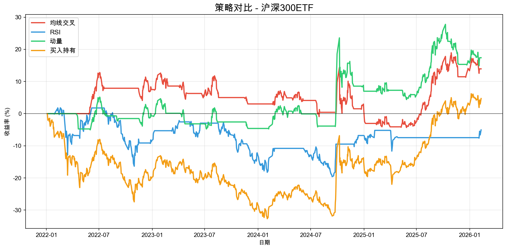
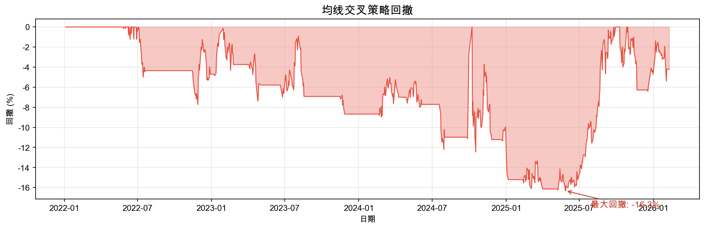
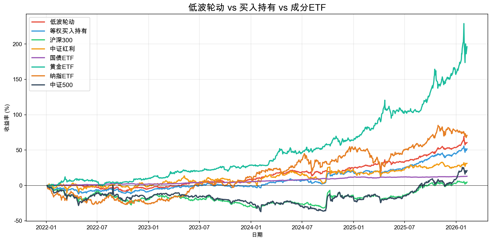
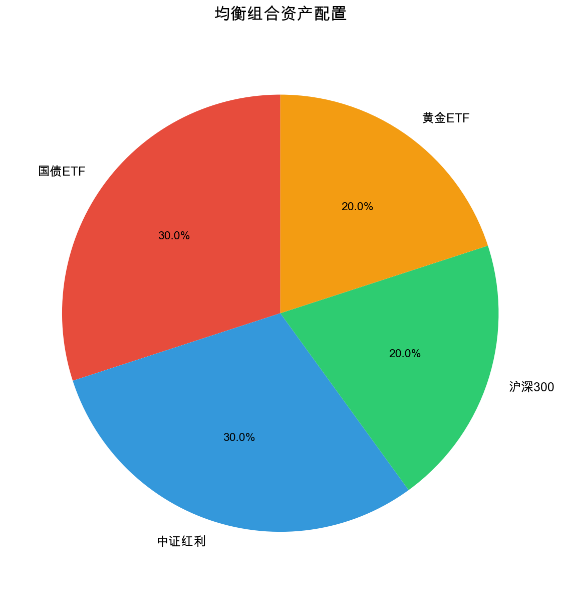
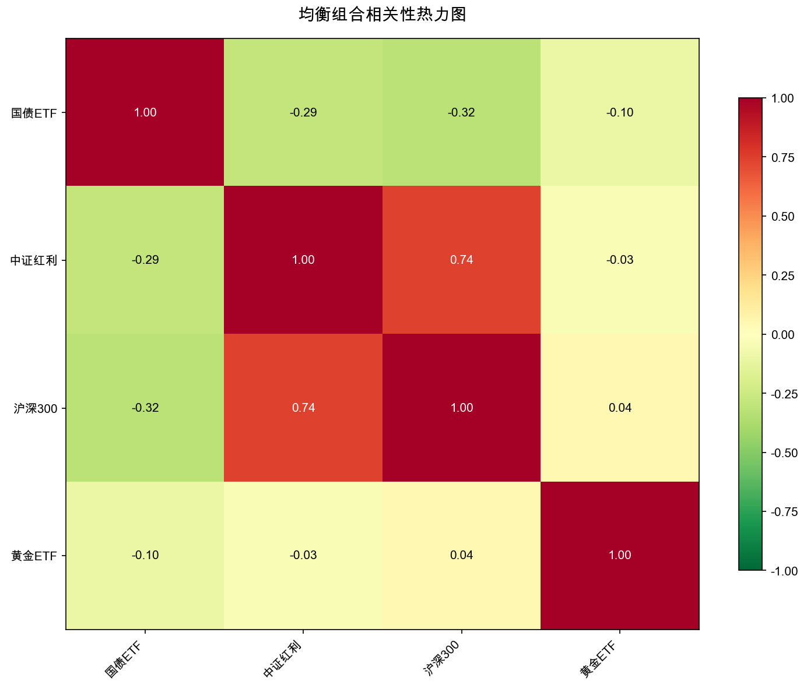

# ezquant 📊

**轻量级A股量化投资工具包** —— 简洁、实用、开箱即用。

> 用 Python 做量化，不必从轮子造起。`pip install` 即可开始。

---

## ✨ 功能亮点

| 功能 | 说明 |
|------|------|
| 📥 **一键获取数据** | 内置16只常用A股ETF，中文名直接调用 |
| 📊 **5大经典策略** | 均线交叉、动量、低波轮动、RSI超买超卖、网格交易 |
| 📈 **向量化回测** | 秒级回测，自动计算年化收益、最大回撤、夏普比率 |
| 💼 **组合管理** | 资产配置、相关性分析、再平衡建议、风险贡献 |
| 🔔 **每日信号** | 一键生成ETF买卖信号报告 |
| 🎨 **专业可视化** | 收益曲线、回撤图、持仓饼图、相关性热力图 |

## 📊 回测实战

> 以下数据为真实运行结果，数据区间 2022-01-04 ~ 2026-02-09（约994个交易日）。

### 🏆 策略对比 — 沪深300ETF

| 策略 | 年化收益 | 最大回撤 | 夏普比率 | 超额收益 |
|------|---------|---------|---------|---------|
| 动量策略(20日) | +4.15% | -15.54% | 0.23 | +12.67% |
| 均线交叉(10/30) | +3.36% | -16.32% | 0.17 | +9.22% |
| RSI超买超卖(14) | -1.31% | -21.05% | -0.22 | -9.77% |
| 买入持有（基准） | +1.17% | -32.69% | — | — |

> 💡 动量策略表现最佳，年化+4.15%、最大回撤仅-15.54%，显著优于买入持有。





### 🔄 ETF低波轮动

每月从6只ETF中选取近期正收益、波动最低的3只等权持有。

| 指标 | 低波轮动 | 等权买入持有 |
|------|---------|-------------|
| 年化收益 | +12.77% | — |
| 最大回撤 | -8.81% | — |
| 夏普比率 | 1.06 | — |
| 总收益 | +60.63% | +51.65% |

> 💡 低波轮动夏普比率达1.06，最大回撤控制在-8.81%，风险收益比优秀。



### 💼 组合优化

三种风格组合对比（2022-01 至今）：

| 组合 | 配置 | 年化收益 | 最大回撤 | 夏普比率 |
|------|------|---------|---------|---------|
| 保守型 | 60%债券 + 20%红利 + 20%黄金 | +9.59% | -4.26% | 1.49 |
| 均衡型 | 30%债券 + 30%红利 + 20%宽基 + 20%黄金 | +9.84% | -6.84% | 0.88 |
| 进取型 | 40%宽基 + 30%红利 + 20%纳指 + 10%黄金 | +9.44% | -16.59% | 0.58 |

> 💡 保守型组合年化9.59%、最大回撤仅-4.26%、夏普1.49，适合稳健投资者。





---

## 📦 安装

```bash
pip install ezquant
```

或者从源码安装：

```bash
git clone https://github.com/yourname/ezquant.git
cd ezquant
pip install -e .
```

## 🚀 5分钟快速开始

### 1️⃣ 获取数据

```python
from ezquant import get_etf, get_etfs

# 用中文名获取沪深300ETF数据
df = get_etf("沪深300", start="2023-01-01")
print(df.tail())

# 批量获取多只ETF收盘价
prices = get_etfs(["沪深300", "中证红利", "黄金ETF", "国债ETF"])
```

### 2️⃣ 运行策略

```python
from ezquant import ma_crossover, rsi_signal, momentum

close = get_etf("沪深300", start="2022-01-01")["Close"]

# 均线交叉策略（10日线上穿30日线买入）
signal = ma_crossover(close, fast=10, slow=30)

# RSI策略（超卖买入，超买卖出）
signal_rsi = rsi_signal(close)

# 动量策略（涨势持有）
signal_mom = momentum(close)
```

### 3️⃣ 回测

```python
from ezquant import backtest
from ezquant.backtest import print_result

result = backtest(close, signal)
print_result(result, "均线交叉策略")

# 输出：
# ================================================
# 📊 均线交叉策略 回测报告
# ================================================
#   总收益率:        +12.35%
#   年化收益率:       +5.82%
#   最大回撤:         -8.23%
#   夏普比率:          0.85
#   ...
```

### 4️⃣ 可视化

```python
from ezquant.plot import plot_returns, plot_drawdown

# 收益曲线（策略 vs 买入持有）
plot_returns(result["nav"], result["benchmark_nav"])

# 回撤曲线
plot_drawdown(result["nav"])
```

### 5️⃣ 每日信号

```python
from ezquant import generate_signals

# 生成今日ETF信号分析
report = generate_signals()
print(report)
```

### 6️⃣ 组合管理

```python
from ezquant import Portfolio

# 构建均衡组合
port = Portfolio({
    "国债ETF": 0.3,
    "中证红利": 0.3,
    "沪深300": 0.2,
    "黄金ETF": 0.2,
})
port.load_data(start="2022-01-01")
port.summary()  # 打印绩效、相关性、再平衡建议
```

## 📋 内置ETF池

| 类别 | ETF | 代码 |
|------|-----|------|
| 红利 | 中证红利、红利低波、红利ETF | 515080, 512890, 510880 |
| 债券 | 国债ETF、十年国债 | 511010, 511260 |
| 商品 | 黄金ETF | 518880 |
| 宽基 | 沪深300、中证500、上证50、创业板 | 510300, 510500, 510050, 159915 |
| 行业 | 医药ETF、消费ETF、银行ETF | 512010, 159928, 512800 |
| 跨境 | 纳指ETF、标普500、恒生ETF | 513100, 513500, 159920 |

## 📂 项目结构

```
ezquant/
├── ezquant/
│   ├── data.py        # 数据获取
│   ├── strategy.py    # 5大策略
│   ├── backtest.py    # 回测引擎
│   ├── portfolio.py   # 组合管理
│   ├── signal.py      # 信号生成
│   └── plot.py        # 可视化
├── examples/
│   ├── quickstart.py              # 5分钟快速体验
│   ├── etf_rotation.py            # ETF轮动策略
│   └── portfolio_optimization.py  # 组合优化
├── README.md
├── setup.py
└── requirements.txt
```

## 🔧 依赖

- Python >= 3.8
- yfinance
- pandas
- numpy
- matplotlib

## ⚠️ 免责声明

本工具仅供学习研究使用，不构成任何投资建议。股市有风险，入市需谨慎。历史表现不代表未来收益。

## 📄 License

[MIT License](LICENSE)

---

**如果觉得有用，请给个 ⭐ Star！**
